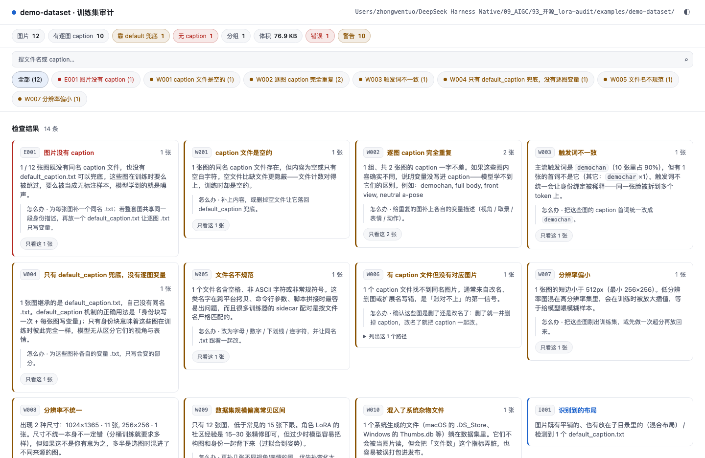

# lora-audit

**你的训练文件夹终于可读了。**

一行命令，把 `dataset/` 里那些没人看得出来的问题摊开：哪张图没有 caption、哪几条 caption 一字不差、触发词在哪张图上写错了、哪些图小得会被插值放大、混进了哪些杂物文件。

不起服务、不建数据库、不改你的文件夹结构。产出是**一个能双击打开的 HTML 文件**。

[English](README.en.md) · [MIT](LICENSE)

---

## 你的文件夹 vs 跑完之后

| 跑之前 | 跑之后 |
|---|---|
| `dataset/` 里 47 张图 + 47 个 `.txt`，长得都差不多 | 每张图的 caption、来源、尺寸一眼可见 |
| 「应该都打了 caption 吧」 | `E001 图片没有 caption 1 张` → 直接告诉你哪张 |
| 训练完效果不对，猜是数据问题 | `W002 逐图 caption 完全重复 2 张` → 变量没写进 caption |
| 不知道该改哪里 | 每条问题下面都有「怎么办」 |



## 30 秒上手

```bash
pip install lora-audit

lora-audit scan ./dataset          # → ./dataset/_lora_audit/report.html
lora-audit scan ./dataset --open   # 顺手打开
```

零依赖（Python 3.9+，只用标准库）。不需要 manifest、不需要配置文件、不需要先按任何规范整理目录。

## 它检查什么

| 规则 | 说明 |
|---|---|
| `E001` | 图片没有 caption（无同名 `.txt`，也没有 `default_caption.txt` 兜底） |
| `W001` | caption 文件是空的（文件计数对得上，内容却是空的） |
| `W002` | 逐图 caption 完全重复（说明变量没写进去） |
| `W003` | 触发词不一致（同一张脸被拆到多个 token 上） |
| `W004` | 只用 `default_caption` 兜底，没有逐图变量 |
| `W005` | 文件名含空格 / 非 ASCII / 非常规符号 |
| `W006` | 有 caption 文件但没有对应图片（改名、删图的残留） |
| `W007` | 分辨率偏小（短边 < 512px） |
| `W008` | 分辨率不统一 |
| `W009` | 数据集规模偏离常见区间（< 15 或 > 150 张） |
| `W010` | 混入系统杂物文件（`.DS_Store` / `Thumbs.db` …） |
| `W011` | `train.txt` / `val.txt` 指向不存在的文件 |
| `W012` | 验证集没有分层（全落在同一组） |
| `W013` | 扩展名与实际格式不符（例如 `.png` 里其实是 WebP） |
| `I001–I003` | 识别到的布局 / 分组分布 / 推定触发词 |

## 支持的目录结构

不要求你改结构，常见的几种都读：

```
dataset/                        dataset/                      dataset/
├── img001.png                  ├── img/                      ├── img/01_face/a.png + a.txt
├── img001.txt                  │   └── 01_face/a.png + a.txt  ├── cap_kohya/01_face/a.txt
└── img002.png（无 caption）     └── default_caption.txt       └── default_caption.txt
   （kohya 平铺）                  （ai-toolkit / 身份块）          （双 profile：变量 + 全量）
```

`cap_kohya/` 这类**镜像 caption 树**会被识别为「同一批图的另一套 caption」，不会误报成孤儿文件。
kohya 的 `10_名称/` 重复次数目录、按子目录分组、混合布局都能读。

## 我有意为之，别报（可选）

有些"告警"是你故意这么做的。比如分辨率不统一——如果你就是按**分桶训练**配的，
那 `W008` 每条都会响，而你能做的只有无视它。这种时候在数据集根放一个 `.lora-audit-ignore`：

```
# 一行一个规则 ID，# 之后写理由
W008 # 方形细节图 2048x2048 与标准格 1773x2364 并存 —— 有意分桶，非混入
```

**豁免 ≠ 隐藏。** 被豁免的规则仍然出现在报告里，只是**降级为「信息」并标注「已豁免」**，
理由原样展示，摘要行也会显示「已豁免 W008」。**我们不会让问题静默消失——审计工具最不能干的就是这个。**

这个文件**完全可选**：没有它时行为与过去一模一样；也不需要为使用它而学任何配置格式。

## 进 CI

```bash
lora-audit scan ./dataset --json -        # 机读结果打到 stdout
lora-audit scan ./dataset --strict        # 有警告也返回退出码 1
```

退出码：`0` 通过 · `1` 发现问题 · `2` 参数或 IO 错误。

## 文档

| 文档 | 看它来回答 |
|---|---|
| [docs/PRD.md](docs/PRD.md)（[English](docs/PRD.en.md)） | **要什么、给谁、不做什么**——目标用户、核心洞察、竞争空白、需求与优先级、**非目标**、风险与反方观点 |
| [docs/DESIGN.md](docs/DESIGN.md)（[English](docs/DESIGN.en.md)） | **为什么这么做**——六条硬约束、14 条决策（含**被否掉的选项与代价**）、模块边界、三层验证各自**查不出**什么、已知缺陷 |
| [CONTRIBUTING.md](CONTRIBUTING.md) | 什么样的规则会被收（六条判据 + 通过/不通过的反例） |
| [CHANGELOG.md](CHANGELOG.md) | 改了什么 |
| [docs/INSTANCES.md](docs/INSTANCES.md) | **真实使用记录**——谁在什么数据上发现了什么、因此改了什么（**「能跑」不算实例**） |

## 边界（这些它不做，也不打算做）

- **不训练**。它只读数据，不碰 kohya / ai-toolkit / OneTrainer。
- **不上传**。没有任何网络请求，报告页也是纯离线的（`lora-audit verify` 会把这条当不变量检查）。
- **不改你的文件**。不移动、不改名、不写入数据集——只多一个 `_lora_audit/` 目录。
- **不起服务**。没有端口、没有数据库、没有后台进程。
- **不做团队协作 / 权限 / 语义搜索**。一个人、一个文件夹、一次审计，就这些。

## 开发

```bash
python3 -m unittest discover -s tests -v          # 端到端自测（纯标准库）
python3 examples/make_example.py                  # 生成一份带已知缺陷的示例数据集
lora-audit scan examples/demo-dataset --open

node tools/browser_check.mjs <report.html> --shot out.png   # 真实 Chrome 实测
lora-audit verify <report.html>                             # 产物不变量自检
```

`tools/browser_check.mjs` 用 CDP 驱动真实 Chrome，检查渲染、抽屉、灯箱、筛选、搜索、
主题切换和控制台报错。它不是可选项——`verify` 查不出「脚本报错」和「路径被双重编码」
（本仓库历史上真的漏过这两个），只有真浏览器能。

## License

MIT
